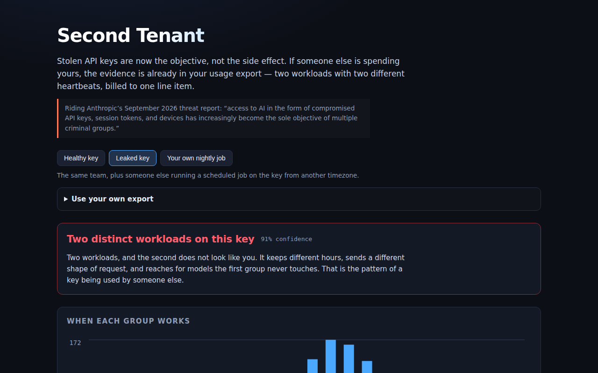

<div align="center">

# Second Tenant

**Is someone else spending your API key?**

[](https://github.com/kbipul/second-tenant/actions/workflows/ci.yml)
[](https://kbipul.github.io/second-tenant/)

`Day 033` of **[kb-daily-builds](https://github.com/kbipul/kb-daily-builds)** — one AI project a day.

</div>

## What it does

Anthropic's September 2026 threat report put a number on something that had been
anecdotal: compromised API keys, session tokens and devices have "increasingly become
the sole objective of multiple criminal groups." One hacktivist campaign ran for a
month entirely on stolen keys. The loot is no longer your data — it is your inference
budget.

Second Tenant looks for that in the one artefact you already have: your usage export.
It clusters every request into two behavioural groups and then asks two separate
questions — **is there a second workload here**, and **does it look like yours?** Drop
in a CSV, get a verdict with the evidence behind it. Everything runs in the browser:
no upload, no API call, no model.

The distinction between those two questions is the whole point. A naive detector fires
on any traffic at 02:00 and tells you your own nightly batch job is an intruder. One of
the three built-in datasets is exactly that case, and the tool is expected to find the
second workload and then decline to call it foreign.



<sub>The sandbox that builds these projects cannot run a browser, so this screenshot is
captured by the repo's own CI on a GitHub runner and committed back — it appears within
a few minutes of the first publish.</sub>

## Try it

**[Live demo →](https://kbipul.github.io/second-tenant/)** — runs fully in your browser,
nothing to install. Three datasets are built in: a healthy key, a leaked one, and a team's
own nightly batch job. Or paste your own export.

```bash
git clone https://github.com/kbipul/second-tenant.git
cd second-tenant
npm ci
npm test          # 65 tests
npm run dev       # http://localhost:5173/second-tenant/
npm run build     # production bundle in dist/
```

## How it works

```
usage export ──▶ parse ──▶ 2-means over ──▶ five signals ──▶ verdict
  CSV / JSON     (column    [hour, log in,   split into
                  aliases)   log out]        two families
                                                 │
                        ┌────────────────────────┴────────────────────────┐
                   RHYTHM (is there a second workload?)      FINGERPRINT (is it yours?)
                   circadian · cadence · weekend              request shape · model mix
```

Three decisions carry most of the weight.

**Rhythm and fingerprint are scored separately, never summed.** Collapsing them into one
number is how a detector ends up accusing a cron job. Rhythm establishes that two
workloads exist; fingerprint establishes whether the second one is a stranger. A high
rhythm score with a low fingerprint score is reported as "a second workload — but it
looks like yours," which is a different sentence from "two distinct workloads on this key."

**The clustering gates its own evidence.** 2-means always returns two groups, even when
there is only one workload. The mean silhouette coefficient measures whether the split is
real, and the rhythm score is multiplied by it. Strong per-signal scores across a boundary
the algorithm had to invent are worth nothing, and the UI shows the separation number so
you can see when that is happening.

**Cadence uses quartile dispersion, not standard deviation.** A job that runs nightly has
one 23-hour gap for every few dozen 70-second ones. A variance-based measure reads that
tail as wild irregularity — exactly backwards for something running like clockwork. The
interquartile spread ignores the tail and describes the typical gap, which is what
"scheduled" actually means. This was a live bug: the first version scored the squatter at
0.22 on cadence when it should have been near 1.00.

Everything is deterministic — same export, same verdict, no randomness anywhere, including
in the seeded fixture generator.

## Build notes — what I learned

The first version of this had one score. Five signals, five weights, one number, three
verdict bands. It passed its tests and it was wrong, and the thing that exposed it was a
test fixture I had written specifically to try to break it: a team's own 02:00 batch
summariser, running on the same key. The detector called it a breach with high confidence.

That is the failure mode of every anomaly tool I have had to live with as an IT Director.
It is not that they miss things. It is that they fire on the nightly job, the quarterly
close, the new starter in another timezone — and after the third false positive nobody
reads the alert. The fix was not better weights. It was noticing that I had been asking
one question when there were two: *are there two workloads* is a clustering fact, and
*is the second one yours* is an identity question, and rhythm evidence can only answer
the first. Splitting them turned a 31% "possible breach" into a sentence that says what
it means.

The cadence bug was more embarrassing and more instructive. I measured regularity with a
coefficient of variation, which is the obvious choice, and it ranked the metronomic
squatter as *more* irregular than the bursty humans. The overnight gaps between scheduled
sessions dominated the variance. Quartile dispersion fixed it in four lines. The general
lesson is one I keep relearning: when a statistic disagrees with something you can see in
the raw data, the statistic is usually measuring a different thing than you think, not
revealing a surprise.

What I would do differently: the clusterer is hard-wired to k=2, which is defensible for a
first cut — one key, one suspected squatter — but three tenants get reported as two with
one blended in. Choosing k by silhouette would be a small change and a more honest answer.
I would also like the timezone to be an input rather than a fixed UTC axis, because a
distributed team currently looks more suspicious than it is, and the tool says so in its
limitations section instead of just handling it.

The limitations section was written before the UI, deliberately. This is a tool that
produces an accusation, and the version of it that is useful to a real security team is
the one that is loud about what it cannot see — most of all that a patient attacker who
mirrors your working hours and prompt sizes leaves nothing here to find. It catches the
common case, which is someone running a scheduled job on a key they stole. That is worth
shipping. Pretending it catches the careful case would not be.

## Stack

| Layer | Choice |
|---|---|
| UI | React 18 + TypeScript 5 |
| Build | Vite 5 |
| Tests | Vitest 2 — 65 tests |
| Clustering | Hand-rolled deterministic 2-means + silhouette, no dependencies |
| Statistics | Circular mean, quartile dispersion, Jensen–Shannon divergence |
| Data | Seeded synthetic fixtures — no real usage data ships in this repo |

## Sources

- Anthropic, *Detecting and Countering Misuse of AI: September 2026* —
  <https://www.anthropic.com/threat-intelligence-report-september-2026>

---

<div align="center"><sub>
Built by <a href="https://www.kumarbipul.com"><b>Kumar Bipul</b></a> ·
IT Director → AI/ML · <a href="https://github.com/kbipul">github.com/kbipul</a>
</sub></div>
